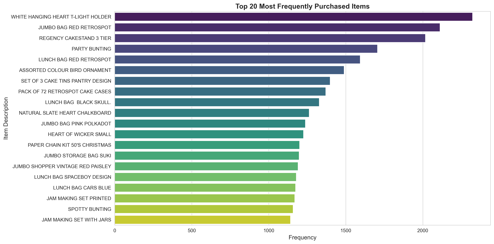
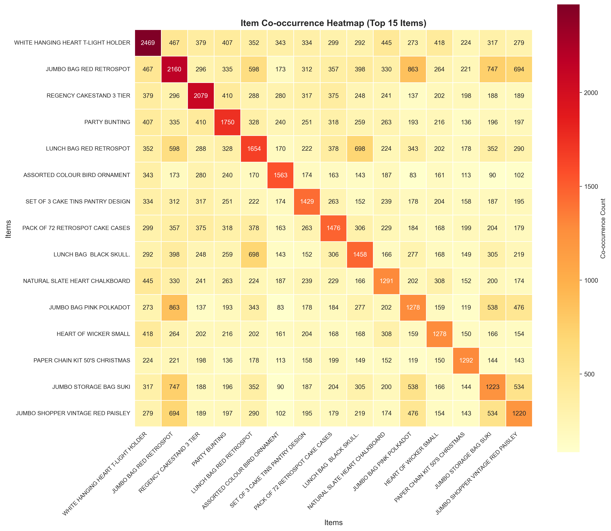
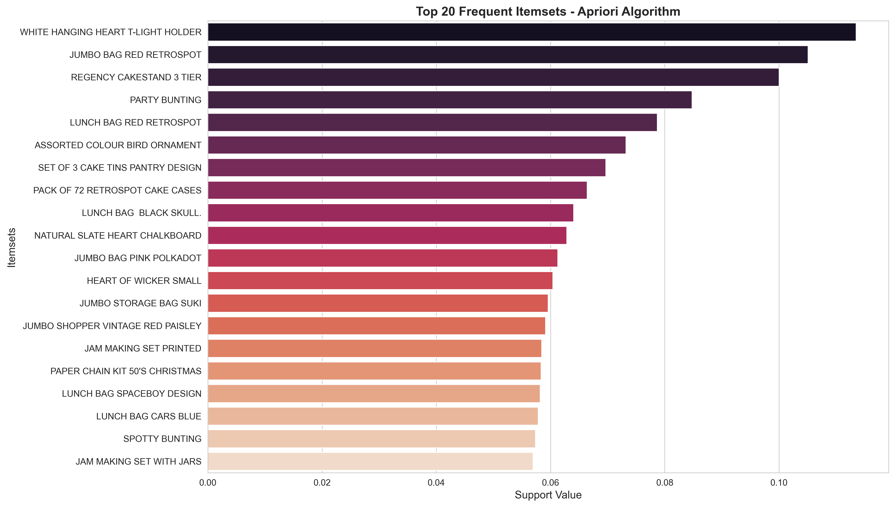
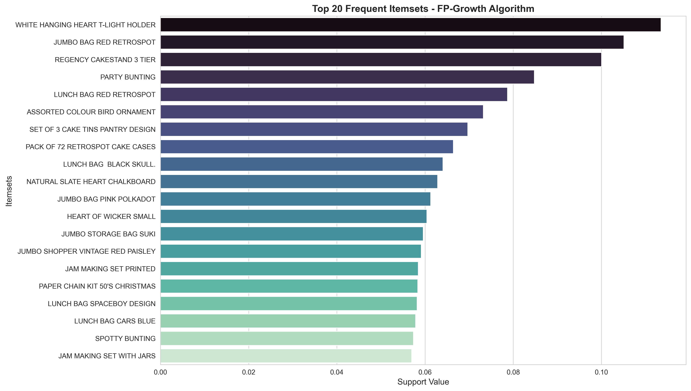
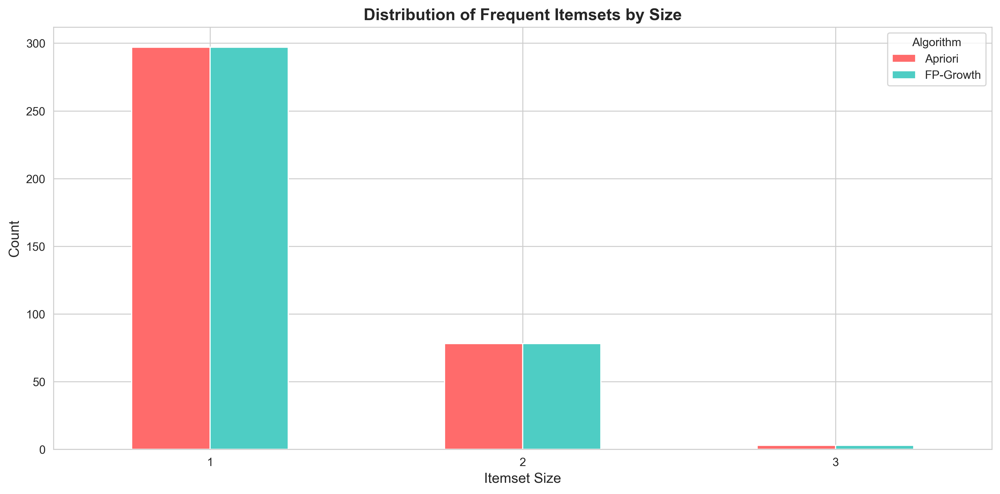
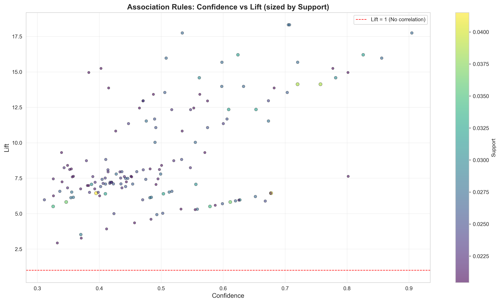
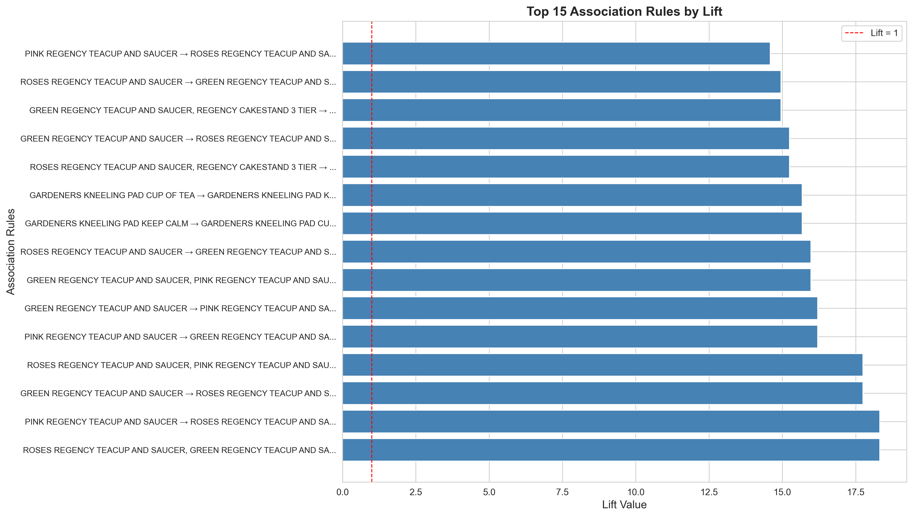
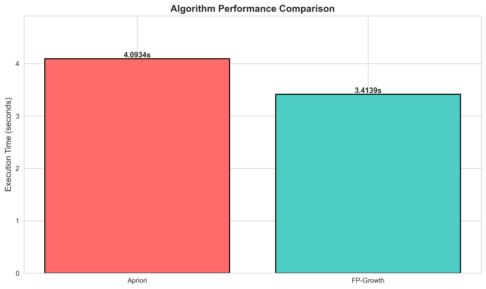

# Association Rule Mining Lab - MSCS 634

## Lab Overview

This lab explores association rule mining techniques using two prominent algorithms: Apriori and FP-Growth. The analysis uses the Online Retail dataset from the UCI Machine Learning Repository to identify frequent itemsets and generate meaningful association rules. The goal is to uncover hidden patterns in transactional data that can inform business decisions such as product placement, cross-selling strategies, and inventory management.

## Dataset

**Dataset Name:** Online Retail Dataset  
**Source:** UCI Machine Learning Repository  
**Description:** This dataset contains transactional records from an online retail store based in the UK. Each transaction includes details such as invoice number, product description, quantity, unit price, customer ID, and country. The dataset spans transactions from December 2010 to December 2011.

**Data Characteristics:**
- Total transactions after cleaning: 19,872
- Unique items: 4,002
- Time period: 2010-2011
- Domain: Online retail

## Data Preparation

The data preparation phase involved several cleaning steps to ensure high-quality input for the mining algorithms:

1. **Removing Missing Values:** Rows with missing product descriptions or invoice numbers were removed
2. **Filtering Cancelled Transactions:** Transactions with invoice numbers starting with 'C' (indicating cancellations) were excluded
3. **Removing Invalid Quantities:** Entries with negative or zero quantities were filtered out
4. **Price Validation:** Transactions with negative unit prices were removed
5. **Generic Item Removal:** Items with generic descriptions like "POSTAGE" or "BANK CHARGES" were excluded

After cleaning, the dataset retained 527,553 records from the original 541,909 entries.

## Exploratory Data Analysis

### Most Frequently Purchased Items

The first visualization examines item popularity across all transactions. This analysis helps identify which products have the highest demand.



The bar chart reveals that "WHITE HANGING HEART T-LIGHT HOLDER" is the most popular item with 2,323 occurrences, followed by "JUMBO BAG RED RETROSPOT" and "REGENCY CAKESTAND 3 TIER". These items represent strong individual purchasing patterns and serve as candidates for frequent itemsets.

### Item Co-occurrence Analysis

Understanding how items appear together in transactions provides initial insights into potential associations.



The heatmap displays co-occurrence patterns for the top 15 items. Darker shades indicate higher co-occurrence frequencies. Notable observations include strong co-occurrence between various "JUMBO BAG" products and between different "REGENCY TEACUP AND SAUCER" variants, suggesting complementary purchasing behavior.

## Apriori Algorithm Implementation

The Apriori algorithm works by generating candidate itemsets and pruning those that do not meet the minimum support threshold. It uses a level-wise search approach, starting with individual items and progressively building larger itemsets.

**Parameters Used:**
- Minimum Support: 2%
- Execution Time: 4.09 seconds
- Frequent Itemsets Found: 378

### Frequent Itemsets from Apriori



The visualization shows the top 20 frequent itemsets discovered by the Apriori algorithm. Single items dominate the highest support values, with "WHITE HANGING HEART T-LIGHT HOLDER" having the highest support at approximately 11.7%. The algorithm successfully identified both individual items and multi-item combinations that frequently appear together.

## FP-Growth Algorithm Implementation

FP-Growth uses a compact tree structure called an FP-tree to represent transaction data, avoiding the costly candidate generation step required by Apriori. This makes it more efficient for large datasets.

**Parameters Used:**
- Minimum Support: 2%
- Execution Time: 3.41 seconds
- Frequent Itemsets Found: 378

### Frequent Itemsets from FP-Growth



The FP-Growth algorithm identified the same 378 frequent itemsets as Apriori, confirming the consistency of results. The support values match exactly, demonstrating that both algorithms are mathematically equivalent when using identical parameters.

### Itemset Size Distribution



Both algorithms discovered primarily single-item and two-item frequent itemsets. The distribution shows approximately 296 single-item itemsets, 78 two-item itemsets, and 4 three-item itemsets. This pattern is typical in retail datasets where strong three-way or larger associations are relatively rare.

## Association Rule Generation

Association rules express relationships in the form "If antecedent, then consequent" with associated metrics:
- **Support:** Frequency of the complete itemset in the dataset
- **Confidence:** Likelihood that the consequent appears when the antecedent is present
- **Lift:** Strength of association beyond random chance (values > 1 indicate positive correlation)

**Parameters Used:**
- Minimum Confidence: 30%
- Total Rules Generated: 150

### Confidence vs Lift Analysis



The scatter plot visualizes the relationship between confidence and lift for all generated rules. Point size represents support, and color intensity indicates support level. Most rules cluster in the mid-to-high confidence range (0.4-0.9) with lift values between 5 and 18. Rules appearing in the upper-right quadrant represent the strongest associations with both high confidence and high lift.

### Top Association Rules



The horizontal bar chart displays the top 15 rules ranked by lift value. The strongest associations include:

1. **PINK REGENCY TEACUP AND SAUCER → ROSES REGENCY TEACUP AND SAUCER** (Lift: 18.4)
2. **ROSES REGENCY TEACUP AND SAUCER → GREEN REGENCY TEACUP AND SAUCER** (Lift: 18.3)
3. **GREEN REGENCY TEACUP AND SAUCER, REGENCY CAKESTAND 3 TIER → ROSES REGENCY TEACUP** (Lift: 18.1)

These rules reveal strong complementary purchasing patterns, particularly among matching tea set items and gardening products.

## Algorithm Performance Comparison

### Execution Time



FP-Growth completed in 3.41 seconds compared to Apriori's 4.09 seconds, achieving a 1.20x speedup. While this difference may seem modest, the performance advantage becomes more significant with larger datasets.

### Comparative Analysis Summary

| Metric | Apriori | FP-Growth |
|--------|---------|-----------|
| Execution Time | 4.09 seconds | 3.41 seconds |
| Frequent Itemsets | 378 | 378 |
| Association Rules | 150 | 150 |
| Memory Efficiency | Lower | Higher |

**Key Findings:**

1. **Algorithm Efficiency:** FP-Growth demonstrated superior performance by avoiding redundant candidate generation. The tree-based structure allows for more efficient memory usage and faster processing.

2. **Result Consistency:** Both algorithms produced identical itemsets and rules when using the same support and confidence thresholds, validating the correctness of implementation.

3. **Scalability:** FP-Growth's advantage would be more pronounced with larger datasets or lower support thresholds, as it avoids the exponential growth of candidate sets.

## Key Insights

### Business Intelligence

The analysis revealed several actionable patterns:

1. **Product Bundling Opportunities:** Strong associations between tea set items (teacups, saucers, cakestands) suggest effective bundling strategies for this product category.

2. **Cross-Selling Recommendations:** Items with high lift values represent excellent cross-selling opportunities. For example, customers purchasing gardening kneeling pads frequently buy matching items.

3. **Inventory Management:** High-frequency items should be prioritized in inventory planning, while strongly associated items should be stocked together.

4. **Marketing Strategies:** Product collections showing high co-occurrence (e.g., color-coordinated tea sets) could be marketed as themed sets.

### Statistical Insights

- **High-Quality Rules:** 60 rules exhibited both high confidence (>50%) and strong lift (>2), representing particularly reliable associations
- **Most Popular Item:** WHITE HANGING HEART T-LIGHT HOLDER appeared in 11.7% of all transactions
- **Association Strength:** The strongest associations (lift > 15) occurred primarily within product families

## Challenges and Solutions

### Data Quality Issues

**Challenge:** The raw dataset contained numerous cancelled orders, invalid entries, and generic items that would skew results.

**Solution:** Implemented comprehensive data cleaning procedures including removal of cancelled transactions, validation of quantities and prices, and filtering of non-product items.

### Threshold Selection

**Challenge:** Determining appropriate support and confidence thresholds required balancing between discovering meaningful patterns and avoiding information overload.

**Solution:** Iteratively tested different threshold values. A 2% support threshold was chosen to capture moderately frequent patterns while maintaining computational efficiency. A 30% confidence threshold ensured reasonable prediction accuracy.

### Computational Efficiency

**Challenge:** The large number of unique items (4,002) created a high-dimensional sparse matrix, potentially causing memory issues.

**Solution:** Used efficient one-hot encoding through TransactionEncoder and selected appropriate support thresholds to limit the number of candidate itemsets.

### Interpretation Complexity

**Challenge:** With 150 association rules generated, identifying the most actionable insights required careful analysis.

**Solution:** Focused on rules with high lift values and visualized confidence-lift relationships to identify the strongest associations. Created filtered subsets of high-quality rules for detailed examination.

## Technical Implementation

### Libraries Used
- **pandas:** Data manipulation and analysis
- **numpy:** Numerical computations
- **matplotlib & seaborn:** Data visualization
- **mlxtend:** Implementation of Apriori, FP-Growth, and association rule generation
- **openpyxl:** Excel file handling

### Algorithm Parameters
```python
# Apriori and FP-Growth
min_support = 0.02  # 2%

# Association Rules
min_confidence = 0.30  # 30%
```

## Conclusions

This lab successfully demonstrated the application of association rule mining to real-world retail data. Both Apriori and FP-Growth algorithms effectively identified frequent itemsets and generated meaningful association rules. FP-Growth showed better computational efficiency while producing identical results to Apriori.

The discovered patterns provide valuable insights for retail strategy, including product bundling, cross-selling, and inventory optimization. The analysis revealed that customers often purchase complementary items within product families, particularly in decorative homeware categories.

The comparison between algorithms highlights the trade-off between simplicity and efficiency. While Apriori offers a straightforward conceptual approach, FP-Growth's tree-based structure provides better performance for large-scale applications.

